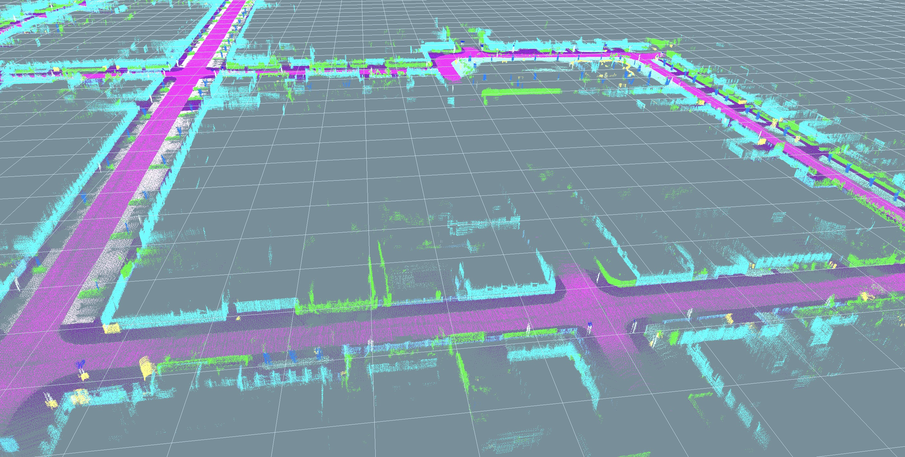

# Semantic-LiDAR-SLAM
A Semantic-SLAM for 3D LiDAR &amp; Visualized by OpenGL &amp; Without ROS

#### [[Demo Video](https://www.bilibili.com/video/BV1jY411n75Q/]

	
  	

<!-- 

	
	
	
	

 -->

## Contributors

Jun Liu (Email: [1193868236@qq.com](1193868236@qq.com))

## Credits

We hereby recommend reading [SC-LEGO-LOAM](https://github.com/irapkaist/SC-LeGO-LOAM.git) ,[SalsaNext](https://github.com/Halmstad-University/SalsaNext.git) and  [semantic_suma](https://github.com/PRBonn/semantic_suma.git)  for reference and thank them for making their work public.

## License

The source code is released under [GPLv3](http://www.gnu.org/licenses/) license.

I am constantly working on improving this code. For any technical issues or commercial use, please contact me(1193868236@qq.com).
